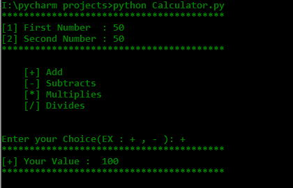

# Pythoncalculator
This is a simple python Calculator ,Using Only Simple python programing.

#Here is a simple python code to make a calculator in PYTHON 
  
  print("Enter your first number:")
n1 = int(input())
print("Enter your operation:")
operation = input()
print("Enter your second number:")
n2 = int(input())

if operation == "+":
    print("Your answer is " , n1 + n2)
elif operation == "-":
    print("Your answer is " , n1 - n2)
elif operation == "*":
    print("Your answer is " , n1 * n2)
elif operation == "/":
    print("Your answer is " , n1 / n2)
elif operation == "**":
    print("Your answer is " , n1 ** n2)
else:
    print("Invalid Input")
